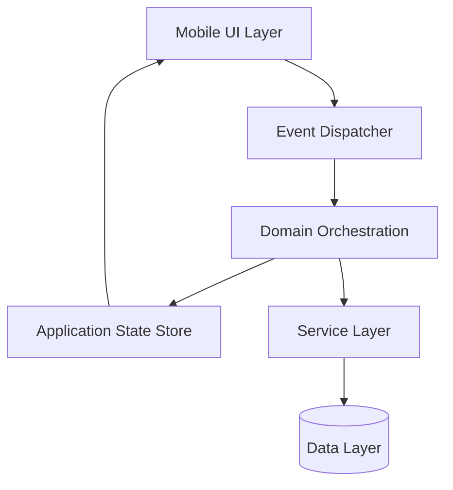

# Wes Huang — Product Engineering Portfolio

CTO · Principal Software Architect  
Mobile Systems · Event-Driven Architecture · Health Applications

I build **cross-platform software systems** that combine mobile UX, native platform integrations, backend orchestration, and architectural discipline to solve real-world friction points.

This repository serves as a **public technical portfolio** describing selected systems and engineering work from private production repositories.

Production code remains private to safeguard intellectual property and protect user privacy. Therefore, this repository focuses on **architecture, engineering principles, and system design**.

---

# Contents

- [Engineering Foundations](#engineering-foundations)
- [System Architecture](#system-architecture)
- [Technology Stack](#technology-stack)
- [Portfolio Projects](#portfolio-projects)
- [Data Modeling Approach](#data-modeling-approach)
- [Engineering Direction](#engineering-direction)
- [Engineering Philosophy](#engineering-philosophy)
- [Contact](#contact)

---

# Engineering Foundations

My work centers around building **complete product systems**, not isolated codebases.

Areas of focus include:

- Mobile application architecture  
- Native platform integrations (iOS / Android)  
- Event-driven application design  
- Backend orchestration and service boundaries  
- Privacy-aware health data applications  
- Consumer-focused product engineering  

Specific designs are crafted across the **entire product stack**, from mobile UX and state management to service orchestration and release engineering.

---

# System Architecture

Across projects, applications generally follow a **shared event-driven architecture** that separates user interaction, orchestration, domain logic, persistence, and UI state updates.

This keeps systems modular, reduces dense UI logic, and allows product workflows to evolve without tightly coupling interface code to business logic while maintaining clear service boundaries.

Architecture diagrams are maintained using **diagram-as-code practices (Mermaid)** so system views remain version-controlled and evolve alongside the codebase.

The Domain Orchestration layer is intent-aware, translating user or system intent into domain behavior and applying predefined entity blueprints through contextual enrichment.

This model is adapted per product, but the architectural pattern remains consistent: **explicit events, intent-driven domain orchestration, service boundaries, and document-oriented persistence**.

---

## Platform & Delivery Architecture

Applications are designed around a **cross-platform delivery model** where a hybrid JavaScript codebase produces both Android and iOS builds.

Certain platform capabilities require native integrations using Swift (iOS) or Android platform APIs, implemented through Capacitor plugin bridges when necessary.

The platform integrates **Capacitor, Webpack, and native mobile tooling** to produce consistent builds while preserving a lightweight and predictable development workflow.

This approach allows rapid product iteration while maintaining full control of the mobile delivery pipeline.

---

# Technology Stack

Core technologies used across projects include:

- Vanilla JavaScript (ES6+)
- Framework7 mobile UI framework
- JSDoc type annotations
- Capacitor mobile runtime
- Swift native plugin integrations
- PocketBase backend services (future auth-only role)
- MongoDB document database (POC)
- Redis distributed caching layer (future)
- Cloudflare Workers
- Webpack build pipelines
- Apple HealthKit integration
- Android platform services

Many projects intentionally favor vanilla JavaScript with JSDoc typing to maintain strong type awareness while keeping the toolchain lightweight and the architecture explicit.

---

# Portfolio Projects

## Winsom

**Motivation-Driven Rewards Platform**

Winsom is a behavioral motivation platform designed to encourage positive actions through structured challenges, prize pools, and reward lockers.

Participants complete challenges and unlock prize opportunities through structured reward allocation.

### Key Concepts

- Challenges
- Locker Lifecycle
- Prize Pools
- Reward Entitlements
- Behavioral Triggers

### Architecture Highlights

- event-driven application architecture  
- dispatcher and domain orchestration model  
- entity factory pattern for domain objects  
- modular state store abstraction  
- document-based persistence using PocketBase  

### System Characteristics

- scalable prize distribution model  
- extensible challenge types  
- multi-collection document data model  
- UI concerns separated from domain orchestration logic

---

## Pulse Pal

**Voice-Aware Blood Pressure Logging**

Pulse Pal is a health application designed to reduce friction in blood pressure tracking through simplified interaction patterns.

The design goal is **fast, low-friction logging** while maintaining structured health records.

### Features

- blood pressure logging
- pulse tracking
- reminder scheduling
- Apple Health integration
- data export capabilities

### Architecture Highlights

- local-first workflow design
- native HealthKit integration
- modular service layer for health synchronization
- intent-driven event orchestration
- voice-aware dictation logging

### Platform Integration

- Apple HealthKit sync
- Capacitor native plugin bridge
- structured health record persistence
- Siri shortcuts
- Apple Watch companion app

---

## Gout Guardian

**Behavior-Driven Gout Management**

Gout Guardian helps users manage gout through hydration monitoring, flare tracking, dietary awareness, and daily prevention workflows.

The application combines multiple health signals into a single daily system.

### Core Components

- hydration tracker
- flare-up log
- gout-safe food lookup
- prevention checklist

### Architecture Highlights

- premium feature gating  
- event-driven state updates  
- local-first data workflows  
- privacy-aware health data model  

### Platform Goals

- Integration with Health Connect/HealthKit
- Voice-aware logging

---

## Tally Tab

**Group Bill Splitting**

Tally Tab is a lightweight application designed to simplify shared expenses between friends or small groups.

The application focuses on reducing friction in situations such as shared meals, travel expenses, or group purchases.

### Core Concepts

- participant expense tracking
- fair balance calculations
- lightweight transaction logging
- simple group reconciliation

### Design Goals

- minimal interaction friction  
- simple financial tracking workflows  
- clear participant balances  
- lightweight mobile-first design

---

## Micro-App Ecosystem

In addition to larger applications, I maintain a set of focused micro-applications designed to solve specific personal health tracking needs.

| Application | Purpose |
|-------------|--------|
| Pulse Pal | Blood pressure tracking |
| Gout Guardian | Gout Management |
| Water Works | Hydration tracking |
| Pace Partner | Activity tracking |
| Simple Sugar | Glucose logging |
| Body Balance | Weight tracking |

These applications share consistent design principles:

- minimal input friction  
- local-first data storage  
- privacy-aware architecture  
- focused single-purpose workflows  

---

# Data Modeling Approach

Data modeling begins with **domain design rather than storage design**. Each application defines its own contextual entity model based on the behaviors, workflows, and state transitions that are meaningful within that product domain.

This approach emphasizes:

- domain-specific entities and terminology  
- contextual relationships between records  
- lifecycle-aware state modeling  
- flexibility to evolve with product behavior  

Many enterprise systems rely on relational databases for consistency, maturity, and widespread expertise. In contrast, these applications often utilize **document-oriented data models** where flexibility and iteration speed are prioritized.

Primary technologies include **PocketBase and MongoDB**, both used with flexible collection structures.

This approach supports:

- iterative product development  
- evolving data structures without frequent migrations  
- simplified service-layer orchestration  

Structural complexity is intentionally managed within the application layer, allowing the data model to evolve alongside product requirements.

---

# Engineering Direction

## Event-Driven Architecture

Application state changes propagate through explicit events rather than dense UI logic.

Benefits include:

- improved testability
- clearer system boundaries
- easier extensibility

---

## Lightweight Stack Philosophy

I prefer **vanilla JavaScript with JSDoc type annotations** rather than heavy compile-time frameworks.

This approach provides many benefits of typed systems while avoiding additional compile steps and complex build pipelines.

Advantages include:

- simpler build processes  
- faster iteration cycles  
- easier debugging in production  
- reduced tooling complexity  
- strong editor support through JSDoc typing  

This philosophy aligns well with **mobile-first applications**, where minimizing build complexity improves developer velocity and system stability.

---

## Minimal Framework Design

Applications favor lightweight frameworks and explicit architecture rather than large, tightly coupled stacks.

Typical characteristics include:

- vanilla JavaScript application logic  
- modular service boundaries  
- small focused libraries rather than heavy frameworks  
- explicit orchestration layers  

This approach keeps systems understandable and reduces long-term maintenance complexity.

---

## Native Platform Integration

Certain capabilities require direct platform integration.

Examples include:

- Apple HealthKit
- device sensors
- OS-level automation

These integrations are implemented using **Capacitor native plugins and Swift bridges** where necessary.

---

# Engineering Philosophy

My engineering approach balances **product pragmatism with architectural clarity**.

Principles I follow include:

- build systems that remain understandable over time  
- favor explicit orchestration over hidden coupling  
- reduce user friction wherever possible  
- design for extensibility even in early product stages  
- prioritize privacy when handling personal data  

The goal is to create systems that can evolve from early prototypes into stable long-term products.

---

# Contact
This repository is intended to provide architectural context for selected systems. Additional details can be discussed upon request.

[LinkedIn](https://www.linkedin.com/in/weshuang/)

[GitHub](https://github.com/whuang-netdiversity)